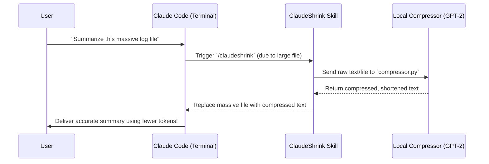

# ClaudeShrink Architecture

ClaudeShrink is a lightweight bridge between Claude Code and a local prompt compression engine. Its goal is to intercept massive text payloads—like log files or documentation—and compress their token footprint before sending them to Anthropic's Claude API.

This document breaks down how the pieces fit together in a simplified way.

## 1. High-Level Flow

When you ask Claude Code to analyze a 10,000-word file, here is what happens:

## 2. Core Components

ClaudeShrink consists of three distinct layers:

### A. The Agent Layer (`SKILL.md`)
Claude Code supports "Skills"—markdown files that teach it how to act in specific scenarios. 
Our `SKILL.md` instructs Claude to automatically intercept large files or pasted text. Instead of reading them directly, it is instructed to pause, write the text to a temporary file, and pass it to our local Python script.

### B. The Python Engine (`scripts/compressor.py`)
This is the workhorse of the application. Once the skill passes the massive text payload to Python, the script:
1. **Chunks the text**: To prevent memory overflow, it splits the massive text into chunks of `~1500` characters.
2. **Compresses via LLMLingua**: It feeds these chunks into Microsoft's `LLMLingua` library.
3. **Uses GPT-2 locally**: Using a small, local `gpt2` model (~500MB, running purely on your CPU), it analyzes the text to determine the "information density" of the words. It deletes filler words, redundancies, and boilerplate, preserving only the critical semantic meaning.
4. **Returns the result**: It recombines the compressed chunks and prints them directly to standard output `stdout`.

### C. The Environment Manager (`install.sh`)
To ensure this tool is "plug-and-play" across Mac and Linux, we use an isolated installation approach.
When you run the installation `curl` command, it sets up an **isolated Python virtual environment (`.venv`)**. This ensures ClaudeShrink's heavy dependencies (`torch`, `transformers`, `llmlingua`) are safely cordoned off and never conflict with your system's global Python installation.

## 3. Why This Approach?

* **Token Savings:** Saves huge amounts of context-window space and API costs by trimming fluff from your text.
* **Deterministic Privacy:** The actual compression runs entirely locally on your CPU via GPT-2. Raw data is never sent to a third-party server during the compression phase.
* **Zero Disruption Setup:** The skill doesn't override Claude Code's native behaviors—it simply acts as an intelligent pre-processing tool exactly when you need it.
